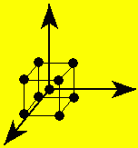
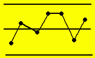

|:--------------------------------------------------:|:---:|:--------------------------------------------------:|
|  |: **Mathews Malnar and Bailey, Inc.** :|  |
|                                                    |: Quality engineering, applied statistical consulting,  and training services for R&D, product, process,  and manufacturing engineering organizations. :|                                                    |

**Upcoming Events:**
* **Quality Managers Network:**
**The Joy of Little Experiments, 7:30-9:00AM, 6 February 2026, by Zoom. Details are posted [here](http://www.mmbstatistical.com/QMN.html).**

* **Quality Engineers Network:**
**Topic TBD, 7:30-9:00AM, 6 2026, by Zoom. Details are posted  [here](http://www.mmbstatistical.com/QEN.html).**

**[What We Do](WhatWeDo.html)**

**Textbooks:**
* [Design of Experiments with MINITAB](DOEwithMINITAB.html)
* [Sample Size Calculations: Practical Methods for Engineers and Scientists](SampleSize.html)

[Courses](Courses.html): Quality engineering statistics, design of experiments, applied statistical methods, metrology, Six Sigma Green Belt and Black Belt, and much more!

[Quality Tools](QualityTools.html): Links to procedures for quality engineering methods

[Test and Measurement Systems](TestAndMeasurementSystems.html): MM&B Inc. also builds custom test and measurement systems

**MINITAB Resources**
* [MINITAB Automation](MINITABAutomation.html): Links to automation instructions and examples
* [MINITAB Macros](MINITABMacros.html): Links to useful macros
* [Introduction to MINITAB course](http://www.mmbstatistical.com/IntroMINITAB.html)

[Reading List](ReadingList.html) : Our favorite quality engineering and statistics references!

[Links](Links.html) : To on-line quality engineering and applied statistics resources, ...

[Contact MM&B Inc.](ContactMMBInc.html)

[Meet MM&B](MeetMMB.html)
